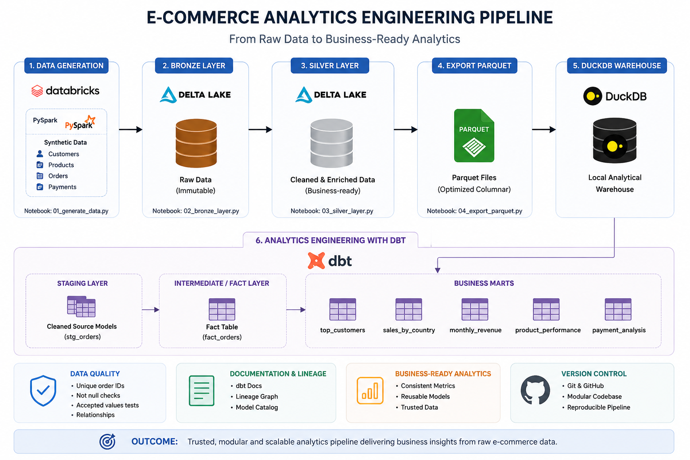
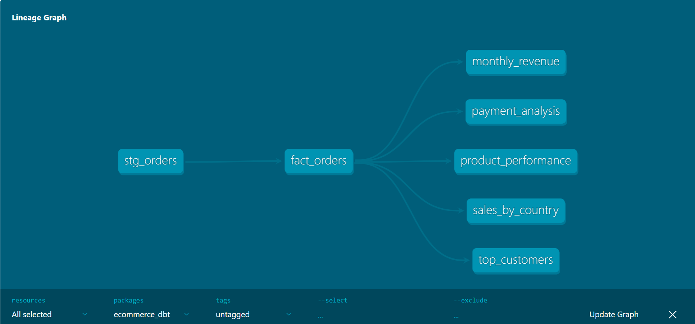
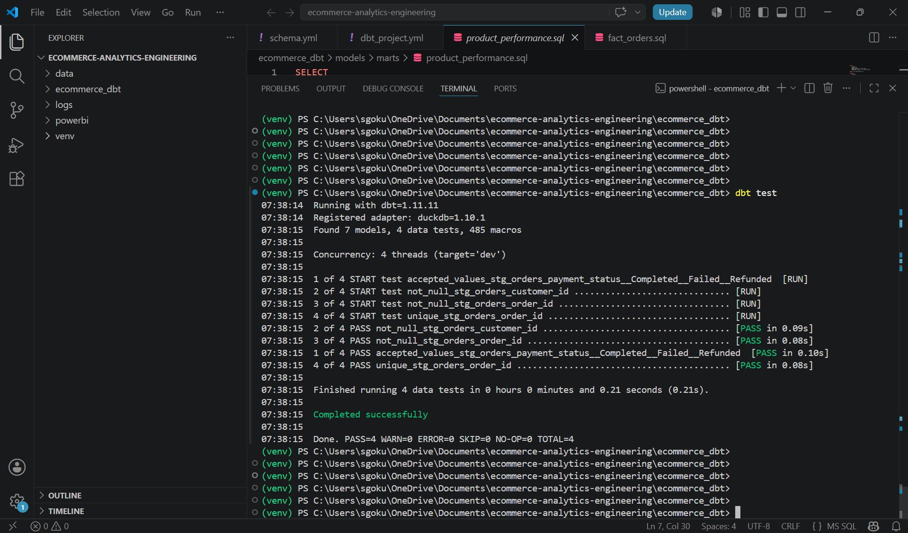
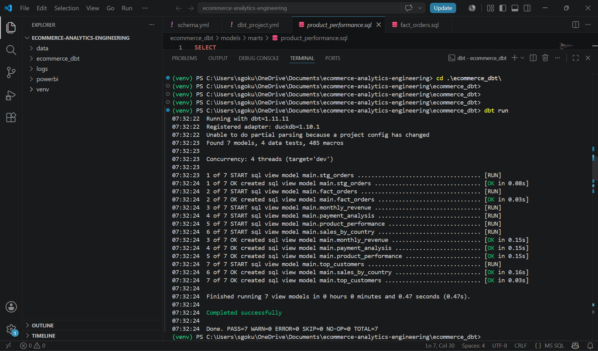

# 🛒 End-to-End E-Commerce Analytics Engineering Pipeline


A modern Analytics Engineering project that demonstrates how raw e-commerce transaction data can be transformed into business-ready analytical datasets using **Databricks, PySpark, Delta Lake, DuckDB, and dbt**.

The project follows a layered architecture inspired by modern data platforms while implementing modular SQL transformations, data quality testing, and automated lineage documentation.

---

# 📌 Architecture



---

# ✨ Features

- End-to-end Analytics Engineering pipeline
- Layered architecture (Bronze → Silver → Fact → Marts)
- Delta Lake based storage
- Modular SQL transformations using dbt
- Data quality validation using dbt tests
- Automated lineage documentation
- Reusable business-ready analytical marts
- Well-structured, production-inspired repository

---

# 🚀 Tech Stack

| Category | Technology |
|----------|------------|
| Data Processing | PySpark |
| Platform | Databricks Community Edition |
| Data Lake | Delta Lake |
| Storage Format | Parquet |
| Analytical Database | DuckDB |
| Analytics Engineering | dbt |
| Programming Language | Python, SQL |
| Version Control | Git & GitHub |

---

# 🏗️ Project Architecture

```
Synthetic Data
        │
        ▼
Databricks (PySpark)
        │
        ▼
Bronze Layer (Delta)
        │
        ▼
Silver Layer (Delta)
        │
        ▼
Parquet Export
        │
        ▼
DuckDB
        │
        ▼
dbt Staging
        │
        ▼
Fact Layer
        │
        ▼
Business Marts
```

---

# 📂 Repository Structure

```
ecommerce-analytics-engineering
│
├── architecture/
├── data_sample/
├── docs/
├── notebooks/
├── screenshots/
├── ecommerce_dbt/
│   ├── models/
│   │   ├── staging/
│   │   ├── intermediate/
│   │   └── marts/
│   ├── macros/
│   ├── tests/
│   └── dbt_project.yml
│
├── requirements.txt
├── README.md
└── .gitignore
```

---

# ⚙️ Pipeline Implementation

## Step 1 — Generate Synthetic Data

Generated realistic e-commerce datasets using PySpark including:

- Customers
- Products
- Orders
- Payments

---

## Step 2 — Bronze Layer

Raw datasets are ingested into Delta Lake without transformation.

Objectives:

- Preserve raw data
- Maintain reproducibility
- Store immutable source records

---

## Step 3 — Silver Layer

Business transformations include:

- Data cleansing
- Data enrichment
- Revenue calculation
- Business joins
- Creation of an analytics-ready dataset

Output:

```
orders_enriched
```

---

## Step 4 — Export to Parquet

The enriched dataset is exported as Parquet files for downstream Analytics Engineering.

---

## Step 5 — Analytics Engineering using dbt

### Staging Layer

```
stg_orders
```

Standardizes and prepares source data.

---

### Intermediate Layer

```
fact_orders
```

Creates a centralized business-ready fact table.

---

### Business Marts

| Model | Description |
|-------|-------------|
| fact_orders | Central business-ready fact table |
| top_customers | Highest revenue-generating customers |
| sales_by_country | Country-wise sales analysis |
| monthly_revenue | Monthly revenue trends |
| product_performance | Product performance analysis |
| payment_analysis | Payment status and payment method analysis |

---

# 📊 dbt Lineage

The following lineage illustrates how the staging model feeds the centralized fact table, which powers all downstream business marts.



---

# ✅ Data Quality Validation

Implemented using **dbt generic tests**.

Current validations include:

- Unique Order IDs
- Non-null Customer IDs
- Accepted Payment Status values

### Test Results



---

# 🚀 Build Results

The project successfully builds all analytical models.



---

# 📈 Project Highlights

- Built using **7 modular dbt models**
- Implemented **4 automated data quality tests**
- Layered architecture from Bronze to Business Marts
- Analytics Engineering workflow using DuckDB and dbt
- Modular SQL transformations using `ref()`
- Automated lineage documentation

---

# 💡 Key Learnings

This project helped deepen my understanding of modern Analytics Engineering practices beyond traditional ETL development.

Key concepts explored include:

- Layered data architecture
- Modular SQL transformations
- Fact-based analytical modeling
- Data quality testing
- Automated lineage documentation
- Building reusable business-ready datasets

---

# 🔮 Future Enhancements

- Incremental dbt models
- CI/CD for dbt deployments
- Automated orchestration
- Cloud deployment (Azure / AWS)
- Business Intelligence integration (Power BI / Apache Superset)

---

# 👨‍💻 Author

**Gokul Saravanan**

Aspiring Data & Analytics Engineer passionate about building scalable data platforms using modern data technologies.

If you have feedback or suggestions, feel free to open an issue or connect with me on LinkedIn.

---

⭐ If you found this project useful, consider giving it a star!
